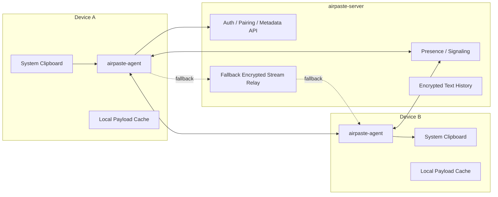
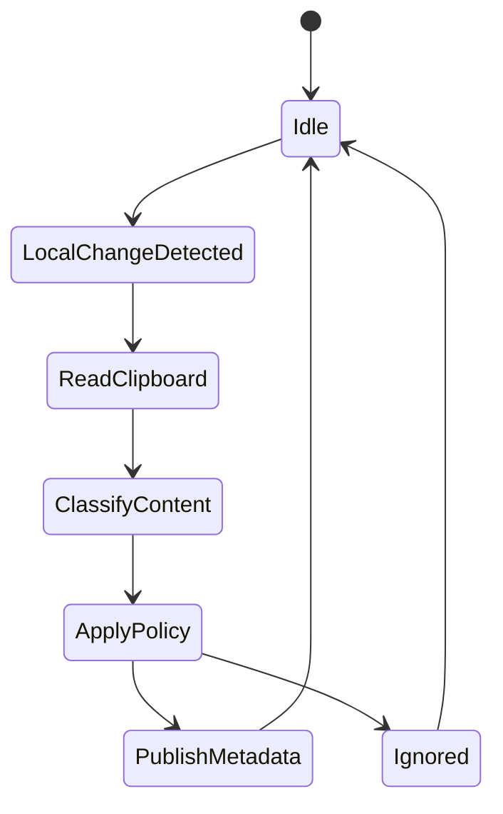
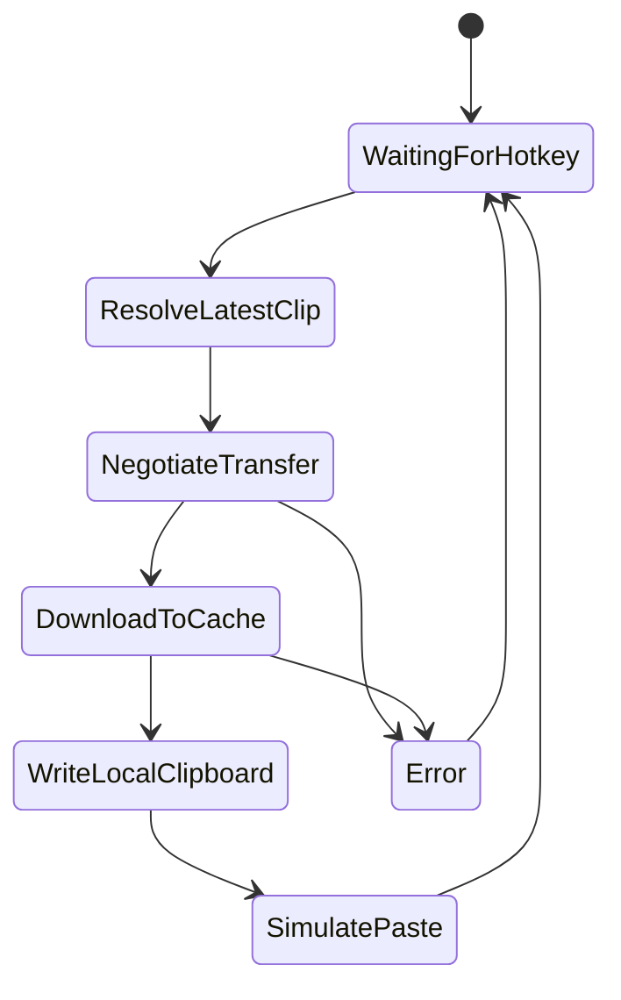

# Air Paste Design

Air Paste is a cross-platform shared clipboard for Windows and macOS. The first target is a reliable personal-device workflow: copy on device A, paste on device B, and transfer the real payload only when needed.

The implementation language is Rust. Platform-specific clipboard and desktop integration are isolated behind Windows and macOS adapters.

## 1. Product Goals

### Goals

- Share text clipboard content between trusted devices.
- Share image clipboard content between trusted devices.
- Share file clipboard intent between devices without eagerly uploading large files.
- Prefer LAN discovery and direct device-to-device transfer.
- Use the public server as a control plane for pairing, device presence, signaling, clipboard metadata, and optional text history.
- Avoid storing file payloads on the server by default.
- Provide an end-to-end encrypted stream relay fallback for networks where direct peer transfer cannot be established.
- Provide a reliable first version through an explicit remote paste hotkey.

### Non-Goals For MVP

- Perfect transparent support for normal `Ctrl+V` / `Cmd+V` file paste in every application.
- Deep Explorer/Finder extension integration.
- Multi-user organization management.
- Mobile support.
- Full image payload sync before text and file transfer are reliable.
- Full conflict-free collaborative clipboard editing.

## 2. Core Architecture

Air Paste is split into three major pieces:

- `airpaste-agent`: a per-user desktop agent running on every Windows/macOS device.
- `airpaste-server`: a public or private server reachable through DDNS or a fixed domain.
- `airpaste-ui`: a small settings and status UI, likely built with Tauri.

High-level flow:



The server should not be the default file transfer path. It coordinates the connection. If direct transfer is impossible, an optional relay can stream end-to-end encrypted bytes without storing them.

## 3. Control Plane And Data Plane

### Control Plane

The control plane is server mediated. It handles small, structured data:

- Account or local group identity.
- Device registration.
- Device pairing.
- Device online status and heartbeats.
- Public and LAN candidate addresses.
- Clipboard metadata.
- Text clipboard history, preferably encrypted.
- File manifests.
- Transfer session negotiation.

### Data Plane

The data plane carries real payload data:

- Text payloads may be sent through the server because they are small, but they should still be encrypted.
- Images can be treated as payloads and transferred peer-to-peer when large.
- Files should transfer device-to-device whenever possible.
- Relay should be optional and stream-only. It should not persist decrypted or encrypted file payloads by default.

Preferred transfer order:

1. LAN direct connection discovered through mDNS or UDP broadcast.
2. Known direct address through server-provided candidates, treated as best-effort.
3. P2P connection negotiated through signaling, only if the implementation includes an explicit NAT traversal strategy.
4. Encrypted stream relay through the server as the reliability fallback.
5. Fail with a clear error if relay is disabled or unavailable.

DDNS makes the server reachable; it does not make two desktop agents mutually reachable. For MVP, the dependable network model is LAN direct transfer plus encrypted relay fallback. Internet P2P across NAT should be considered a later optimization unless the project adopts ICE/STUN/TURN or an equivalent design.

## 4. MVP User Experience

### Text

When device A copies text:

1. Agent A detects clipboard sequence change.
2. Agent A reads text content.
3. Agent A applies local filters for sensitive content.
4. Agent A encrypts and sends text metadata/content to the server.
5. Agent B receives a clipboard update.
6. Agent B writes the text to its local clipboard, unless the user has disabled auto-apply.

Text can also appear in a small clipboard history UI, but history should be disabled by default or use a short TTL. Clipboard text often contains passwords, access tokens, verification codes, and private keys.

### Images

When device A copies an image:

1. Agent A detects the image content.
2. Small images may be sent through the server if configured.
3. Larger images are represented as a payload manifest.
4. Agent B fetches the image on demand or prefetches based on size limits.
5. Agent B writes image data to the local clipboard.

### Files

The first reliable implementation should use an explicit remote paste hotkey.

When device A copies files:

1. Agent A detects file clipboard content.
2. Agent A does not upload file payloads.
3. Agent A creates a file manifest with paths, sizes, modified times, file kinds, and a transfer token. It must not eagerly hash large files or walk beyond configured limits.
4. Agent A sends the encrypted manifest to the server.
5. Agent B records that a remote file clipboard is available.

When the user wants to paste on device B:

1. The user presses the Air Paste remote paste hotkey, for example `Ctrl+Shift+V` on Windows or `Cmd+Shift+V` on macOS.
2. Agent B resolves the latest remote file manifest.
3. Agent B negotiates a direct connection to Agent A.
4. Agent B downloads the files into a local cache directory.
5. Agent B writes local file references into the system clipboard.
6. Agent B simulates a normal paste action into the active application.

This avoids depending on whether the target application reads the clipboard early for preview or validation.

Some applications will still handle file paste differently. If paste simulation fails, is disabled, or lacks OS permissions, Agent B should leave the downloaded files in the cache and expose a fallback action such as opening the cache directory or copying local file paths.

## 5. Clipboard Model

The system should represent every clipboard update as a `ClipRecord`.

```rust
pub struct ClipRecord {
    pub clip_id: ClipId,
    pub source_device_id: DeviceId,
    pub created_at: Timestamp,
    pub expires_at: Option<Timestamp>,
    pub kind: ClipKind,
    pub encryption: EncryptionInfo,
}

pub enum ClipKind {
    Text(TextClip),
    Image(ImageClip),
    Files(FileClip),
}
```

### TextClip

```rust
pub struct TextClip {
    pub utf8_len: u64,
    pub preview: Option<String>,
    pub encrypted_body_ref: BlobRef,
}
```

The `preview` must be optional and should never contain unencrypted sensitive content unless the user explicitly allows it.

### ImageClip

```rust
pub struct ImageClip {
    pub width: u32,
    pub height: u32,
    pub mime: String,
    pub byte_len: u64,
    pub payload_ref: PayloadRef,
}
```

### FileClip

```rust
pub struct FileClip {
    pub files: Vec<FileEntry>,
    pub total_size: u64,
    pub transfer_token: TransferToken,
    pub source_peer_url: Option<String>,
    pub transfer_expires_at: Option<Timestamp>,
}

pub struct FileEntry {
    pub relative_path: String,
    pub display_name: String,
    pub size: u64,
    pub modified_at: Option<Timestamp>,
    pub sha256: Option<String>,
    pub kind: FileEntryKind,
}

pub enum FileEntryKind {
    File,
    Directory,
    Symlink,
    MacAppBundle,
}
```

For MVP, symlinks can be rejected or copied as plain files only if the behavior is explicit.

`sha256` should be optional metadata, not a required manifest-generation step. For large files and directories, integrity should be verified by streaming hashes during actual transfer rather than blocking clipboard publication.

## 6. Device Discovery

### LAN Discovery

Use mDNS for local discovery:

- Service name: `_airpaste._tcp.local`
- TXT records:
  - `device_id`
  - `device_name`
  - `agent_version`
  - `protocol_version`
  - `port`

Each agent also maintains a local listener for peer connections.

### Server Presence

Every agent maintains a WebSocket connection to the server:

- Heartbeat interval: 15-30 seconds.
- Server tracks online/offline state.
- Server forwards clipboard metadata notifications.
- Server forwards peer and relay negotiation messages.

## 7. Networking Protocol

### Server API

Suggested API shape:

- `POST /v1/pair/start`
- `POST /v1/pair/confirm`
- `GET /v1/devices`
- `POST /v1/clips`
- `GET /v1/clips/latest`
- `GET /v1/clips/history`
- `DELETE /v1/clips/{clip_id}`
- `GET /v1/ws`

The WebSocket carries event messages:

```json
{
  "type": "clip.created",
  "clip_id": "01J...",
  "source_device_id": "dev_...",
  "kind": "files"
}
```

Other event types:

- `device.online`
- `device.offline`
- `transfer.offer`
- `transfer.answer`
- `transfer.candidate`
- `transfer.relay_ready`
- `transfer.cancelled`
- `transfer.completed`

### Peer Protocol

The peer protocol should run over TLS or QUIC with mutual device authentication. QUIC/TLS provides transport security, but it does not solve NAT traversal by itself.

Initial message:

```json
{
  "type": "transfer.request",
  "clip_id": "01J...",
  "transfer_token": "short_lived_token",
  "requester_device_id": "dev_...",
  "requested_files": ["."],
  "request_signature": "base64..."
}
```

Response:

```json
{
  "type": "transfer.accept",
  "session_id": "tx_...",
  "total_size": 123456789,
  "chunk_size": 1048576
}
```

Data should be chunked, checksummed, resumable where practical, and cancellable.

The transfer token must be one-time use, short-lived, and bound to the clip ID, source device ID, recipient device ID, and transfer route. A token alone must not be enough to retrieve files; the peer must also authenticate the requesting device and verify its signature.

### Relay Protocol

The relay is a fallback data path, not file storage:

- The server creates an authorized relay session for a specific source device, recipient device, and clip ID.
- Both agents connect to the relay session over authenticated TLS/WebSocket or QUIC streams.
- The source agent encrypts payload chunks end-to-end for the recipient before sending them through the relay.
- The server enforces TTL, maximum bytes, bandwidth limits, and cancellation.
- The server does not decrypt, index, preview, or persist file payload bytes.

## 8. Security Model

### Trust Boundary

Devices in the same Air Paste group are trusted. The server is not trusted with plaintext clipboard content if end-to-end encryption is enabled.

### Device Identity

Each device generates a long-term identity key during setup:

- Preferred: Ed25519 for identity/signatures.
- Preferred: X25519 for session key agreement.

The server stores public device keys only.

### Pairing

Pairing flow:

1. Existing trusted device creates a short pairing code or QR payload.
2. New device submits the pairing payload.
3. Existing trusted device confirms the new device identity key, preferably with a visible fingerprint.
4. Existing trusted device signs or approves the new device key.
5. Both devices store each other's public identity keys.
6. Server records the trusted device relationship.

For a personal-only MVP, a server-side invite code can be accepted as a temporary registration shortcut, but it must not be the final trust root. The server can help a device join the account or group; an existing trusted device should still approve the new device key before it can read clipboard content or request file transfers.

### Encryption

Recommended:

- Metadata and payloads encrypted per recipient or per trusted group.
- AEAD: XChaCha20-Poly1305 or AES-GCM.
- Per-clip random content key.
- Content key wrapped for every authorized device.

For server relay:

- Relay receives only encrypted byte streams.
- Relay validates session authorization and bandwidth limits.
- Relay does not persist payloads.

### Sensitive Text Filtering

Text history should be opt-in or conservative by default. Add local filters for:

- Password-field copies where detectable.
- One-time codes.
- Access tokens.
- Private keys.
- Credit card-like strings.
- Very large text blobs.

For history storage, filtering should prefer false positives over leaks: it is better to skip storing a suspicious clip than to keep a secret. Live clipboard sync may be less aggressive to avoid breaking normal clipboard behavior, but history recording should be conservative and easy to disable.

## 9. Platform Integration

### Windows Agent

Responsibilities:

- Run per user session, not only as a Windows service.
- Watch clipboard changes with Win32 clipboard APIs.
- Read and write Unicode text.
- Read and write images.
- Read file clipboard data using `CF_HDROP`.
- Write local file clipboard data using Shell-compatible formats.
- Register global hotkey for remote paste.
- Simulate paste only after local clipboard has been populated.
- Provide tray menu and status.

Important Windows APIs and concepts:

- `AddClipboardFormatListener`
- `WM_CLIPBOARDUPDATE`
- `OpenClipboard`
- `GetClipboardData`
- `SetClipboardData`
- `CF_UNICODETEXT`
- `CF_DIB` / PNG custom formats
- `CF_HDROP`
- `RegisterHotKey`
- `SendInput`

Avoid running clipboard operations from a non-interactive service session. A background service can exist later for networking, but clipboard access belongs in the user session process.

### macOS Agent

Responsibilities:

- Run as a LaunchAgent or menu bar app.
- Poll or observe `NSPasteboard` change count.
- Read and write text.
- Read and write images.
- Read and write file URLs.
- Register global hotkey.
- Request accessibility permission if simulating paste.
- Provide menu bar status.

Important macOS APIs and concepts:

- `NSPasteboard`
- `NSPasteboard.PasteboardType.string`
- `NSPasteboard.PasteboardType.tiff`
- file URL pasteboard types
- `CGEvent` for simulated key events
- Accessibility permission for input simulation
- Login item or LaunchAgent startup

macOS clipboard monitoring is typically implemented by polling `changeCount` at a short interval. Keep the interval modest to avoid power drain.

## 10. Local Cache

Every agent keeps a local payload cache:

- Windows: `%LOCALAPPDATA%\AirPaste\cache`
- macOS: `~/Library/Caches/AirPaste`

Cache contents:

- Downloaded remote file payloads.
- Temporary image payloads.
- Transfer metadata.

Rules:

- Use per-clip subdirectories.
- Sanitize file names for the target OS.
- Preserve directory structure where possible.
- Enforce cache size limit.
- Enforce TTL, for example 24 hours.
- Delete failed partial transfers unless resume metadata is available.
- Never expose cached files as authoritative originals.

## 11. File Handling Rules

### Cross-Platform Path Rules

Store file paths in manifests as normalized relative paths using `/`.

Reject or sanitize:

- Absolute paths.
- `..` path traversal.
- Windows reserved names such as `CON`, `PRN`, `AUX`, `NUL`.
- Invalid Windows characters: `<`, `>`, `:`, `"`, `|`, `?`, `*`.
- Names that differ only by case when writing to a case-insensitive filesystem.

### Directories

Directory copy should preserve structure. For MVP:

- Walk directories when creating the manifest.
- Apply a max file count limit.
- Apply a max total size limit.
- Detect unreadable files and report them.

### macOS Bundles

`.app` is a directory bundle. Treat it as a directory, but mark it as `MacAppBundle` in the manifest so the receiver can preserve it clearly.

### Symlinks

For MVP, either:

- Reject symlinks and show an error, or
- Resolve and copy the target as a regular file.

Do not recreate symlinks on the receiving side until the security model is reviewed.

## 12. Rust Workspace Layout

Suggested repository layout:

```text
air-paste/
  Cargo.toml
  crates/
    airpaste-core/
    airpaste-agent/
    airpaste-server/
    airpaste-protocol/
    airpaste-crypto/
    airpaste-platform/
    airpaste-platform-windows/
    airpaste-platform-macos/
    airpaste-transfer/
    airpaste-ui/
  docs/
    DESIGN.md
```

### Crates

`airpaste-core`

- Shared domain types.
- Configuration model.
- Device model.
- Clip model.
- Error types.

`airpaste-protocol`

- Server API DTOs.
- WebSocket messages.
- Peer protocol messages.
- Version negotiation.

`airpaste-crypto`

- Device identity.
- Pairing key exchange.
- Content encryption.
- Key wrapping.

`airpaste-transfer`

- Peer listener.
- Transfer session manager.
- Chunking and checksums.
- LAN direct transfer.
- Relay client.

`airpaste-platform`

- Cross-platform traits:
  - `ClipboardProvider`
  - `HotkeyProvider`
  - `PasteSimulator`
  - `TrayProvider`

`airpaste-platform-windows`

- Win32 implementation.

`airpaste-platform-macos`

- macOS implementation using Objective-C/Swift interop as needed.

`airpaste-agent`

- Main desktop daemon.
- Clipboard watcher.
- Server connection.
- Sync state machine.
- Local cache.
- Transfer orchestration.

`airpaste-server`

- HTTP API.
- WebSocket signaling.
- Device registry.
- Clip metadata storage.
- Optional relay.

`airpaste-ui`

- Tauri settings/status UI.
- Can call local agent through localhost HTTP, Unix socket, or named pipe.

## 13. Key Rust Dependencies

Candidate dependencies:

- Async runtime: `tokio`
- HTTP server: `axum`
- HTTP client: `reqwest`
- WebSocket: `tokio-tungstenite` or `axum` WebSocket support
- Serialization: `serde`, `serde_json`
- Database: `sqlx`
- Local embedded database: `redb`, `sled`, or SQLite through `sqlx`
- IDs: `uuid` or `ulid`
- Crypto: `ring`, `ed25519-dalek`, `x25519-dalek`, `chacha20poly1305`
- mDNS: `mdns-sd`
- QUIC: `quinn`
- TLS: `rustls`
- Logging: `tracing`, `tracing-subscriber`
- Config: `figment` or `config`
- Error handling: `thiserror`, `anyhow`

The exact dependency choices should be validated during implementation. Prefer mature crates and keep platform-specific crates isolated.

## 14. Server Storage

The server can use SQLite for MVP and PostgreSQL later if needed.

Suggested tables:

- `accounts`
- `devices`
- `device_keys`
- `pairing_sessions`
- `clip_records`
- `clip_recipients`
- `text_history`
- `presence_sessions`
- `relay_sessions`

File payloads are not stored by default.

Text history storage should store encrypted content. If previews are used, previews should be either disabled by default or generated locally in the UI after decryption.

## 15. Agent State Machine

### Clipboard Watch



The agent must avoid feedback loops:

- Tag clipboard writes performed by Air Paste.
- Ignore self-originated clipboard changes for a short window.
- Track source device and clip ID.

### Remote Paste



## 16. Configuration

Example config:

```toml
[server]
url = "https://paste.example.com"

[device]
name = "Workstation"

[clipboard]
sync_text = true
sync_images = false
sync_files = true
auto_apply_text = true
auto_apply_images = false
save_text_history = false
text_history_ttl_minutes = 10

[transfer]
prefer_lan = true
enable_internet_p2p = false
enable_relay = true
max_file_count = 10000
max_total_size_mb = 10240
relay_max_size_mb = 2048
relay_session_ttl_minutes = 30
cache_ttl_hours = 24
cache_max_size_mb = 20480

[hotkeys]
remote_paste_windows = "Ctrl+Shift+V"
remote_paste_macos = "Cmd+Shift+V"
```

## 17. Observability

Use structured logs with `tracing`.

Important events:

- Device paired.
- Server connected/disconnected.
- Clipboard update detected.
- Clip ignored by policy.
- Manifest published.
- Transfer started.
- Transfer route selected.
- Transfer progress.
- Transfer completed.
- Transfer failed.
- Relay used.

The UI should expose a simple diagnostics page with:

- Server connection state.
- Current device ID.
- Known devices.
- Last clipboard sync time.
- Last transfer route.
- Recent errors.

## 18. MVP Implementation Plan

### Phase 1: Skeleton

- Create Rust workspace.
- Define shared domain types.
- Define protocol messages.
- Implement basic server with health check and WebSocket.
- Implement basic agent startup and config loading.

### Phase 2: Pairing And Presence

- Generate device identity.
- Register device with server.
- Implement pairing code flow.
- Require existing trusted-device approval before a new device can decrypt clips or request transfers.
- Maintain WebSocket heartbeat.
- Show known online devices.

### Phase 3: Text Sync

- Implement Windows text clipboard watcher/writer.
- Implement macOS text clipboard watcher/writer.
- Publish encrypted text clips.
- Receive and apply remote text clips.
- Add optional text history with conservative filtering and short TTL.

### Phase 4: File Manifest Sync

- Detect copied files on Windows and macOS.
- Build file manifest.
- Publish manifest only.
- Show remote file clipboard availability.

### Phase 5: Reliable File Transfer MVP

- Implement peer listener.
- Implement LAN discovery and direct LAN transfer.
- Implement minimal encrypted stream relay fallback.
- Implement transfer authorization by clip ID, source device, recipient device, and one-time token.
- Download to local cache.
- Write local file references to clipboard.
- Implement remote paste hotkey.
- Provide fallback action when paste simulation is unavailable or fails.

### Phase 6: Image Sync

- Implement image manifest and payload handling.
- Allow small encrypted image payloads through server only if configured.
- Transfer larger images through direct LAN or relay.
- Decide whether images auto-apply to clipboard or wait for explicit user action.

### Phase 7: Internet P2P Optimization

- Evaluate ICE/STUN/TURN or another explicit NAT traversal strategy.
- Add internet P2P only if it improves reliability without weakening authorization.
- Keep relay as the dependable fallback.

### Phase 8: UI And Packaging

- Build Tauri UI.
- Add tray/menu bar integration.
- Add settings page.
- Add device list.
- Add diagnostics view.
- Package Windows installer.
- Package macOS app bundle and LaunchAgent/login item.

## 19. Risks And Decisions

### Main Risks

- Clipboard behavior differs across applications.
- File paste is hard to make fully transparent.
- NAT traversal may fail in real networks.
- macOS permissions can make simulated paste feel confusing.
- Sensitive text can leak if history defaults are too permissive.

### Current Decisions

- Rust is the implementation language.
- Server is primarily a control plane.
- File payloads are not stored on the server by default.
- Relay is stream-only, end-to-end encrypted, and available as the MVP reliability fallback.
- MVP uses explicit remote paste hotkey for files.
- Text history is optional, encrypted, conservative, and disabled by default.

## 20. Open Questions

- Should the first server version require user accounts, or only a private deployment token?
- What is the default maximum file size for remote paste?
- What is the default maximum relay transfer size?
- Should images auto-apply to clipboard or wait for explicit user action?
- Is relay allowed on the user's DDNS Windows server for files up to the configured relay size limit?
- Should the agent support multiple clipboard channels later, such as personal/work profiles?

